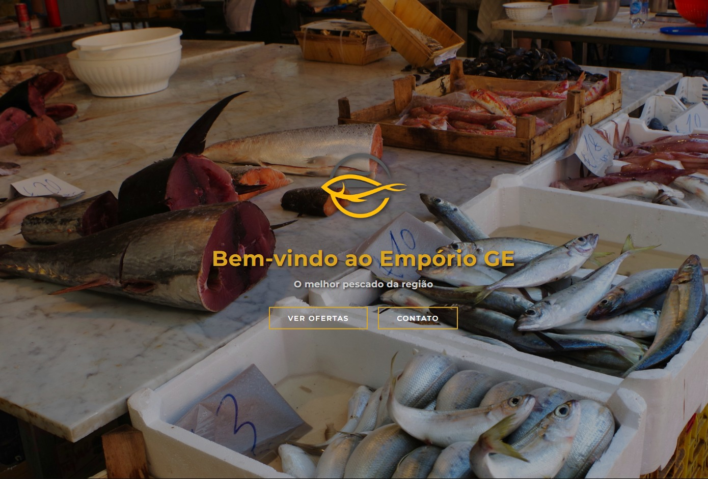

## 🖥️ Prévia do projeto

> A imagem abaixo apresenta uma prévia do site em desenvolvimento.



---

# 🐟 Empório GE

Site institucional e catálogo digital desenvolvido para o **Empório GE**, uma peixaria local, como parte da disciplina **Atividades Interdisciplinares de Extensão I**, na área temática de Tecnologia.

O projeto busca aplicar conhecimentos de Tecnologia da Informação na criação de soluções que atendam às necessidades identificadas no estabelecimento, contribuindo para a divulgação dos produtos e para a melhoria de processos internos.

---

## 📚 Sobre o projeto

O **Empório GE** é uma peixaria que comercializa diferentes tipos de pescados.

Durante o desenvolvimento do projeto de extensão, foi identificada a oportunidade de utilizar soluções tecnológicas para auxiliar tanto na **divulgação dos produtos** quanto na **organização dos processos internos** do estabelecimento.

A proposta foi dividida em duas soluções principais:

- 🌐 **Site:** apresentação dos produtos, ofertas e informações do Empório GE;
- 📱 **Aplicativo:** auxílio no controle de entrada e saída de produtos.

Este repositório é destinado ao desenvolvimento do **site do Empório GE**.

---

## 🎯 Objetivos

### Objetivo geral

Desenvolver uma solução web para modernizar a apresentação dos produtos do Empório GE, facilitando o acesso dos clientes às ofertas e ao catálogo de produtos.

### Objetivos específicos

- Criar uma presença digital para o estabelecimento;
- Apresentar os produtos de forma organizada;
- Destacar ofertas e promoções;
- Desenvolver uma interface simples e intuitiva;
- Facilitar o acesso às informações dos produtos;
- Criar uma estrutura que possa futuramente receber funcionalidades relacionadas a pedidos e delivery.

---

## 💻 Tecnologias utilizadas

O projeto utiliza tecnologias fundamentais para o desenvolvimento web:

- **HTML5** — estruturação das páginas;
- **CSS3** — estilização e organização visual;
- **JavaScript** — implementação de comportamentos e interações;
- **Nunjucks** — renderização dos templates HTML;
- **Vercel Functions e CDN** — entrega dinâmica da página e dos arquivos estáticos.

## 🚀 Desenvolvimento local

Instale as dependências e inicie o ambiente da Vercel:

```bash
npm install
npm run dev
```

A página inicial fica disponível em `http://localhost:3000` por padrão. Execute
os testes com `npm test`.

---

## 🗂️ Estrutura do projeto

```text
Emporio_GE/
│
├── functions/
│   └── index.js
│
├── images/
│   ├── atum.jpg
│   ├── Corvina.webp
│   ├── fileti.webp
│   ├── fundo.png
│   ├── Logo.png
│   ├── peixaria.jpg
│   ├── previa.jpg
│   ├── peixe.jpg
│   ├── produto.jpg
│   ├── Sardinha.jpg
│   ├── tilapia.jpg
│   └── zap.png
│
├── js/
│   ├── header.js
│   ├── hero.js
│   └── script.js
│
├── style/
│   ├── header.css
│   ├── hero.css
│   └── main.css
│
├── templates/
│   └── index.html
│
├── package.json
├── vercel.json
└── README.md
```


## 👥 Equipe

Projeto desenvolvido por alunos do Projeto desenvolvido por alunos do curso de Ciência da Computação(UNINASSAU).
do curso de Ciência da Computação.

Os discentes em questão:

- Akilles Rodrigues                            - Matheus Cabral Cavalcanti
- Cauã Falcão Da Silva Nascimento              - Murilo Noceda da Cunha Lemes Cavalcanti
- Guilherme Santos Pessoa De Melo              - Rafael Arcanjo dos Santos Alves
- James de Sousa Veríssimo                     - Rayane Luma Rodrigues da Silva
- Maick Ferreira Nascimento                    - Victor Gabriel Baracho da Rocha
